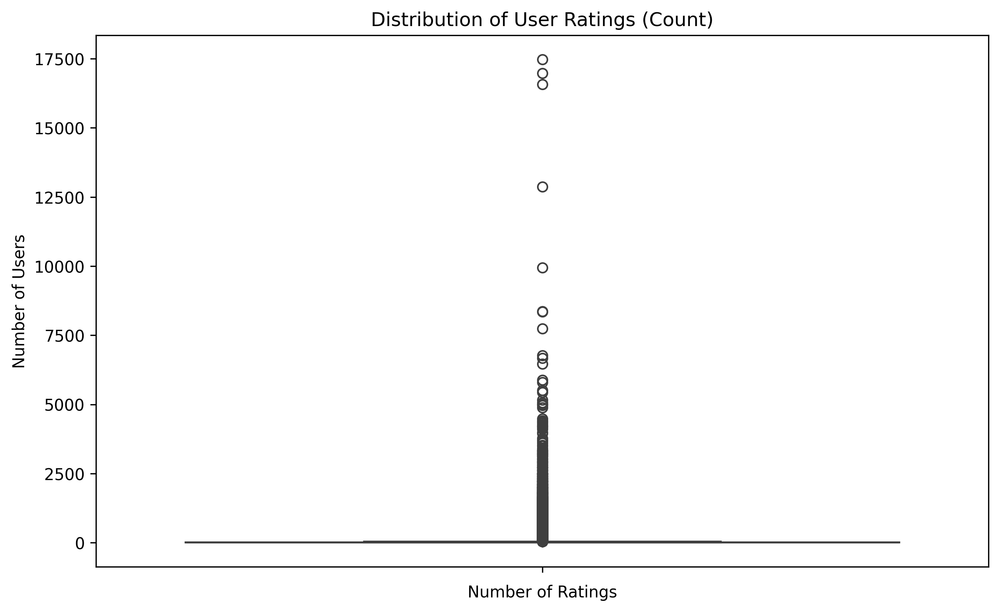
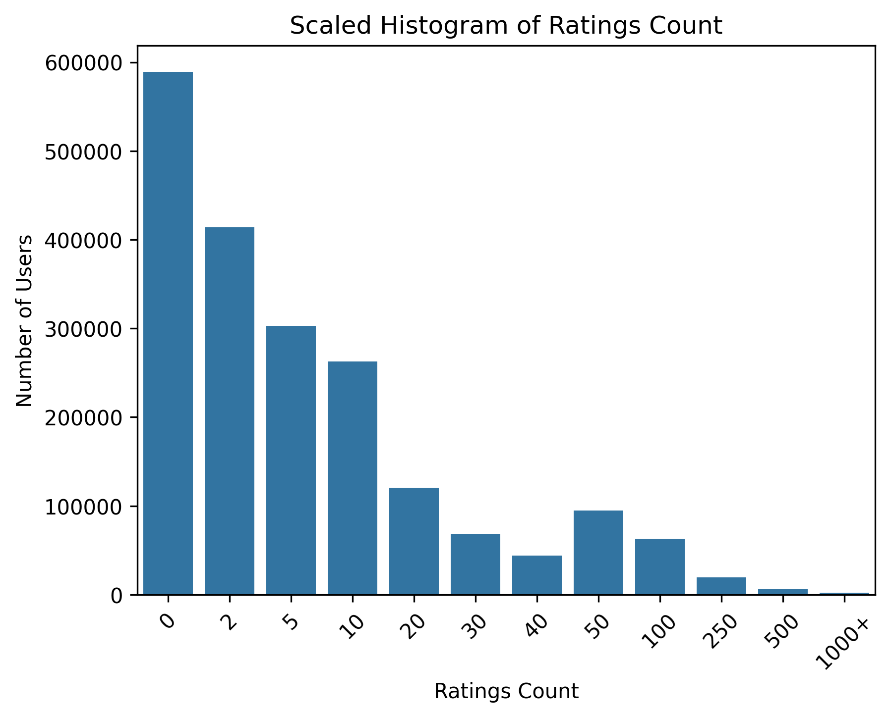
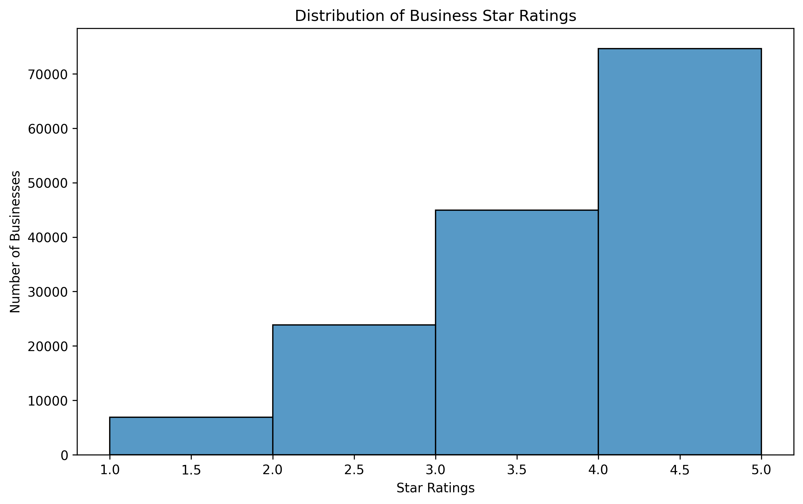
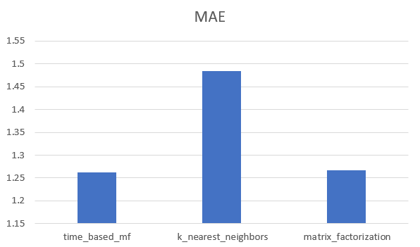
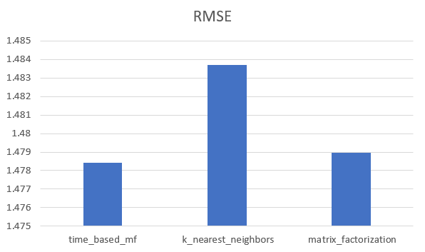
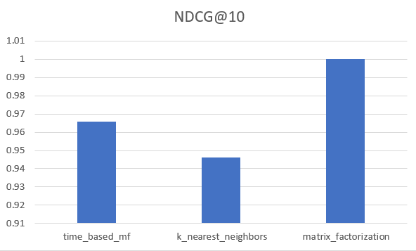

# Time-Based Yelp Reviews

## Problem Statement
The domain for our project is businesses, restaurants included, that are part of the Yelp datat set. The intended use of our application is to provide better 
recommendations to users than yelp would by utilizing matching learning to provide personalized recommendations based on time slots. 
Users would prefer using our algorithm it since it uses predefined time blocks as considered factors, which would depend on where the user is.

We expect users to interact with the system by using their location and time for the application to use to recommend businesses they should go to. 
Some expected characteristics of a good or effective recommendation in our application is that our time-based system is personalized and 
capable of recommending something new that the user hasn't visited before. While our system provides an effective 
proof-of-concept for the investigation of these kinds of systems, there are many areas for improvement with regards to 
the implementation of our algorithm.

## Data Description
We will be working with the Yelp Academic Dataset that is available for download [at this link](https://yelp.com/dataset/). This dataset contains five unique JSON files in total; however, for our project we focus on three primary files, ignoring checkin data and tip data (which are Yelp-specific features that we felt were uneccessary for our experiment):

**Note:** All preprocessed data mentioned here as parsed and saved separately is stored in an open-source format supported by 
the Apache Foundation called Parquet. It is a medium compression file format that provides first-class support for pandas and the
other libraries at use in this project. Therefore, we use this format to store all partial dataframes. All preprocessed dataframes
are located [here](/data_preprocess) and these can be converted to pandas dataframes using utility functions written in [the parquet script file](/ingest/parquet_ingest.py) and documented in the [README file for `/ingest/`](/ingest/README.md).

### yelp_academic_dataset_business.json

**Size:** This file contains 150,346 unique businesses.

This json file is a complex combination of nested json objects containing all relevant information regarding a business. This includes all of the following columns for generic data about a specific business:

| Column Name  | Data Type         | Always Included? |
|--------------|-------------------|------------------|
| business_id  | string (22 chars) | Yes              |
| name         | string            | Yes              |
| address      | string            | Yes              |
| city         | string (2 chars)  | Yes              |
| state        | string            | No               |
| postal code  | string            | Yes              |
| latitude     | float             | Yes              |
| longitude    | float             | Yes              |
| stars        | float (1 decimal) | Yes              |
| review_count | integer           | Yes              |
| is_open      | integer (0 or 1)  | Yes              |

For our use, we will only use `business_id`, `name`, `review_count` and `is_open` from these columns - the rest are discarded
and the modified data frame can be loaded from the pruned_business.json in the [data_preprocess](/data_preprocess/) folder.

And the following columns contain nested objects that we parse further:

#### Operating Hours Data
A nested dictionary containing day-of-the-week keys along with a corresponding string 
in the format HH:MM-HH:MM (or H:M-H:M) denoting a range of time (24 hour format) during which the business is open.
Crucial in performing time-based recommendations, we parse this nested data into its own dataframe in three main steps:

1) Construct a dataframe copying over the `business_id` column from the business json file.
2) Parse the time string into two integers, each with two digits (perhaps a leading 0).
3) For each day of the week present, put the formatted time string (in the newly formatted integers combined into HH:MM format)
   in the corresponding `[day]_open` and `[day]_close` columns in the new dataframe.
4) This new dataframe is saved to a parquet file for reused later in the [preprocessed data folder.](/data_preprocess/)

All of this logic is performed in the [hours ingesting script.](/ingest/hours_ingest.py) This same file also contains a separate function, documented in the [ingest README](/ingest/README.md) that allows the formatted timstring to be split into distinct
integers for use.

#### Attributes
A nested dictionary containing key/value pairs representing features that a business 
may offer for their customers. These keys always contain values set by the business 
when it is registered on yelp. 

As each business may or may not define *any* attributes, or it may only define *some*
attributes. Parsing the attributes into a separately searchable dataframe is 
critical for some of our computations. Our script parses the attributes into
python types as shown in the following table. These attributes will enable more accurate similarity computations between our businesses. This will be a variable used in the project testing stage.

The data extracted for each business is then stored in the parquet format in [this directory](/data_preprocess/) for use
with the rest of this repository.

| Attribute Key              | Parsed Type  | Possible Values                                                                                                                      |
|----------------------------|--------------|--------------------------------------------------------------------------------------------------------------------------------------|
| ByAppointmentOnly          | bool/none    | true/false/null                                                                                                                      |
| BusinessAcceptsCreditCards | bool/none    | true/false/null                                                                                                                      |
| Bike Parking               | bool/none    | true/false/null                                                                                                                      |
| RestaurantsPriceRange2     | integer/none | 1/2/3/4/null                                                                                                                         |
| CoatCheck                  | bool/none    | true/false/null                                                                                                                      |
| RestaurantsTakeOut         | bool/none    | true/false/null                                                                                                                      |
| RestaurantsDelivery        | bool/none    | true/false/null                                                                                                                      |
| Caters                     | bool/none    | true/false/null                                                                                                                      | 
| WiFi                       | string       | free/paid/no/none                                                                                                                    |
| BusinessParking            | string/none  | Null or a comma separated list containing any of: lot, garage, validated, valet, or street                                           | 
| Wheelchair Accessible      | bool/none    | true/false/null                                                                                                                      |
| HappyHour                  | bool/none    | true/false/null                                                                                                                      |
| OutdoorSeating             | bool/none    | true/false/null                                                                                                                      |
| HasTV                      | bool/none    | true/false/null                                                                                                                      |
| RestaurantsReservations    | bool/none    | true/false/null                                                                                                                      | 
| DogsAllowed                | bool/none    | true/false/null                                                                                                                      |
| Alcohol                    | string       | full_bar/beer_and_wine/none                                                                                                          |
| GoodForKids                | bool/none    | true/false/null                                                                                                                      |
| RestaurantsAttire          | string/none  | casual/dressy/formal/none                                                                                                            |
| Ambience                   | string/none  | Null or a comma separated list containing any of: hipster, intimate, trendy, casual, classy, romantic, upscale, divey, or touristy   |
| RestaurantsTableService    | bool/none    | true/false/null                                                                                                                      |
| RestaurantsGoodForGroups   | bool/none    | true/false/null                                                                                                                      | 
| DriveThru                  | bool/none    | true/false/null                                                                                                                      |
| NoiseLevel                 | string       | quiet/average/loud/very_loud/none                                                                                                    |
| GoodForMeal                | string/none  | Null or a comma separated list containing any of: dessert, breakfast, brunch, lunch, dinner, or latenight                            |
| BusinessAcceptsBitcoin     | bool/none    | true/false/null                                                                                                                      |
| Smoking                    | string       | yes/no/outdoor/none                                                                                                                  |
| Music                      | string/none  | Null or a comma separated list containing any of: jukebox, livekaraoke, dj, background_music, no_music, or video                     |
| GoodForDancing             | bool         | true/false                                                                                                                           |
| AcceptsInsurance           | bool/none    | true/false/none                                                                                                                      |
| BestNights                 | string/none  | Null or a comma separated list containing any of: sunday, monday, tuesday, wednesday, thursday, friday, or saturday                  |
| BYOB                       | bool/none    | true/false/none                                                                                                                      |
| Corkage                    | bool/none    | true/false/none                                                                                                                      |
| BYOBCorkage                | string       | yes_free/yes_corkage/no/none                                                                                                         |
| HairSpecializesIn          | string/none  | Null or a comma separated list containing any of: asian, perms, africanamerican, straightperms, coloring, curly, kids, or extensions |
| Open24Hours                | bool         | true/false                                                                                                                           |
| RestaurantsCounterService  | bool         | true/false                                                                                                                           |
| AgesAllowed                | string       | allages/18plus/21plus                                                                                                                |
| DietaryRestrictions        | string/none  | Null or a comma separated list containing any of: kosher, halal, soy-free, vegetarian, gluten-free, or dairy-free                    |

#### Categories
Categories are generic tags that can be assigned to a particular business by its owner. 
There are over 150,000 unique tags for 1300 unique companies in this dataset. 
Originally, we intended to use the categories as an extra dimension of similarity between businesses; 
however, due to the volume of categories and the time constraints on the project, this is not feasible for our purposes.
The code to parse the business categories into their own parquet data frame [here](/data_preprocess/) to make this data easily accessible.

### yelp_academic_dataset_user.json

**Size:** This file contains 1,987,897 unique users.

Information regarding a specific Yelp user is stored in this JSON file:

| Column Name        | Data Type          |
|--------------------|--------------------|
| user_id            | string (22 chars)  |
| name               | string             |
| review_count       | integer            |
| yelping_since      | string (YYY-MM-DD) |
| friends            | string array       |
| useful             | integer            |
| funny              | integer            |
| cool               | integer            |
| fans               | integer            |
| elite              | integer array      |
| average_stars      | float              |
| compliment_hot     | integer            | 
| compliment_more    | integer            |
| compliment_profile | integer            | 
| compliment_cute    | integer            | 
| compliment_list    | integer            |
| compliment_note    | integer            |
| compliment_plain   | integer            |
| compliment_cool    | integer            |
| compliment_funny   | integer            |
| compliment_writer  | integer            | 
| compliment_photos  | integer            |

Of this data, we will strip and store the `user_id`, `name`, `review_count`, `friends`, and `average_stars` columns in the 
[preprocessed data folder.](/data_preprocess/) In these columns, `average_stars` is the average rating across all reviews left
by a specific user; whereas, the `friends` column contains an array of `user_id`s that this user is friends with. Some of these
might be transitive.

### yelp_academic_dataset_review.json

**Size:** This file contains 6,990,280 unique reviews.

Within each row, representing a review, the following information is available:

| Column Name | Data Type           |
|-------------|---------------------|
| review_id   | string (22 chars)   |
| user_id     | string (22 chars)   | 
| stars       | integer             |
| date        | string (YYYY-MM-DD) |
| text        | string              |
| useful      | integer             |
| funny       | integer             |
| cool        | integer             |

From this data frame, we will extract and use the `review_id`, `user_id`, `stars`, and `date` columns.

## Exploratory Data Analysis
**User and Item Distributions:**
- Objective: Understand the distribution of reviews among users and businesses.
- User Distribution Graph:
  - Visualize the number of reviews per user.
  - Identify the distribution pattern, such as whether there are a few users with many reviews or a more evenly spread distribution.
  - Explore potential outliers or power users who contribute significantly to the review count.

  - Started with a box plot, but due to outliers, a more fine-grained histogram was needed:

- Item Distribution Graph:
  - Visualize the number of reviews per business (item).
  - Identify popular businesses with a high number of reviews and less-reviewed businesses.
  - Assess the diversity of businesses in the dataset.

- Insights:
  - Identify clusters of similar users, which can inform the recommendation system about user segments with common preferences.
  - Explore the relationships between users and potentially discover user groups with distinct preferences.

## Algorithms
### Baseline Evaluation Setup:
Metrics:

- **MAE (Mean Absolute Error)**: Measures the average absolute differences between predicted and actual values. Lower MAE indicates better performance.
- **RMSE (Root Mean Squared Error)**: Similar to MAE but gives more weight to large errors. It is the square root of the average squared differences between predicted and actual values.
- **NDCG (Normalized Discounted Cumulative Gain)**: Evaluates the ranking quality of the algorithms. It considers both the relevance and ranking position of items.
Purpose of Metrics:

Error Detection: MAE and RMSE help identify the accuracy of predictions by quantifying the differences between predicted and actual values.
Ranking Comparison: NDCG assists in comparing the ranking performance of algorithms, essential for recommendation systems.

The family of machine learning algorithms we are using are matrix factorization, k-nearest neighbors, a matrix factorization variant using hours of operation as features, and a second matrix factorization variant using hours of operation and business attributes as features. 

We use these because we want to make predictions that adapt to local patterns and target users with similar interests. We believe that refinining searches based on hours of operation and relevant attributes will make recommendations highly accurate and targetted.

For KNN, the dataset was reduced to 1.5% due to numpy array memory errors from the matrices being too large. 
Despite this seemingly low percentage, given that the dataset contains over 6.9 million reviews, this is still nearly 100,000 reviews to train and test with.

## Experiment
When testing our recommender in its application we will use the following testing procedure:
1. We start by producing a standard KNN, and MF algorithm to serve as baseline algorithms for our testing. Due to limitations with the KNN implementation in scikit-surprise, we must limit our dataset to 1.5% (potentially higher by the time of final submission) for all recommenders.
2. The next algorithm produced, a matrix factorization algorithm where 1-hour time blocks are used as factors in the similarity computation, is tested in a similar manner.
3. For each algorithm, we will perform hyperparameter grid searches with the same parameter grid for each MF algorithm, and a predefined grid for KNN. These grids will be somewhat arbitrary in their definition, but they will be focused on limiting the time of the experiment. Ideally, with unlimited time, a large grid could be searched to find the ideal parameters.
4. Once tuned, our models will be tested on an 80:20 split. Once trained and tested, the metrics defined above will be collected and plotted for analysis.

Results:
### MAE

### RMSE

### NDCG@10

- In order to actually build my proposed application, I would need to perform more tuning to find the ideal parameters and maybe some cross validation to improve these mertrics for the time-based mf algorithm to make it more personalized for the users, since MF and KNN are the baseline algorithms. 

## Reflection
What didn't work for our project was utilizng the full review dataset for KNN since it required creating a cosine similarity matrix. Since it was so big, we would run into memory errors due to the size. An approach we decided to go with was to use a small subset of the entire review dataset since it couldn't hold all of it.
We had the same issue with the user-based collaborative filtering algorithm we originally wanted to go with, but later decided to go for a time-based version of our
matrix factorization algorithm. 

Features that worked well were the time based recommendations. Using the time that the program was compiled, it would recommend businesses to a user based on 
the times they opened/closed that day. It was data driven by using the json and parquet files we had to determine what businesses the user didn't leave a 
review for to make sure we aren't recommending a businesses they most likely visited before. 

We ran out of time to finish the experimentation with the business attributes data. While the time-based CF was functional to a partial degree, we were unable to sufficiently train and test this form of the algorithm in time for the deadline. As such, we stripped some of the code and documentation from the project to present what was completed. Ideally, an attribute-extended algorithm would be feasible given a larger amount of compute resources and time.

### Personal Contributions
- Derek: Developed the MF and KNN baselines algorithms, and worked on the time-based MF algorithm to recommend businesses to a user using 30 minutes time intervals. Gathered the metrics (MAE, KNN, NDCG) for each algorithm and created charts to visualize the accuracy of these algorithms. 

- Carson: Developed an additional time-based algorithm focused on a CF mechanism using 1 hour time intervals. Carried out EDA operations,
and performed large-scaled ingesting on the dataset. Architected experimental design and wrote large amounts of 
documentation while formatting code for readability.
